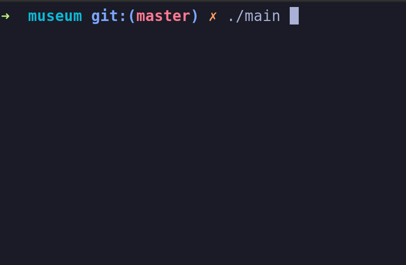
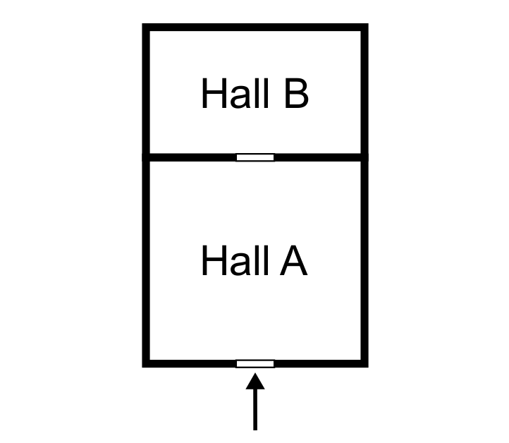

# Museum



## Problem formulation
Imagine a small museum with just 2 halls: A and B. While visiting the museum you
enter the hall A, and you can reach hall B by passing through hall A. The situation is
depicted in the following figure:



People visiting the museum enter hall A, watch the exhibition, and decide whether they want to continue by proceeding to hall B. Some people leave the museum immediately, others enter hall B, watch the second exhibition, and than enter once again hall A, and finally leave. For safety reasons there must be no more than NA people in hall A at the same time, and no more than NB people in hall B (NB < NA ).

The algorithm allows:
- visiting the museum at the same time by as many people as possible,
- leaving the museum by people visiting hall B in the shortest possible time.

## Installation

Clone the repo:
```
git clone https://github.com/AndrewChmutov/Multithreaded-Museum
```

Navigate to the directory:
```
cd Multithreaded-Museum
```

Create new directory and cmake it:
```
mkdir build
cmake -S . -B build
```

Build the program:
```
cmake --build build
```

## Usage

You can run the program 
- without CLI arguments:
```
./main
```

- with CLI arguments:
```
./main capacity-a capacity-b amount-of-people
